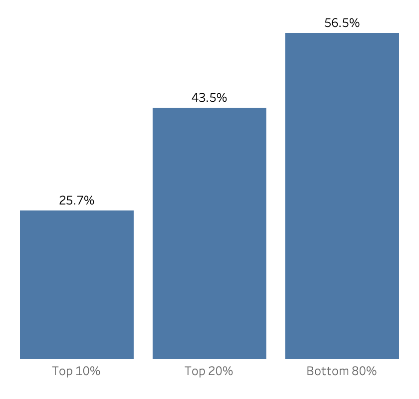
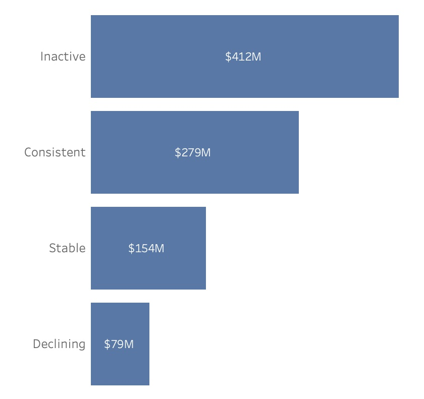
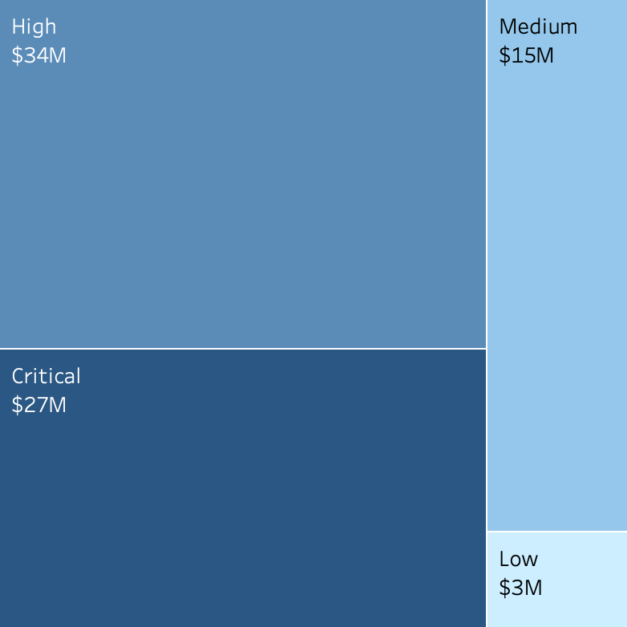

# Revenue Risk & Customer Dependency Analysis — Contoso

## Business Context
Contoso is a large-scale retail company operating across multiple countries and product categories. Revenue grew from **\$88M in 2015** to a peak of **\$444M in 2022**, followed by a noticeable decline—raising concerns around revenue stability, customer retention, and long-term sustainability. 
Leadership suspects that revenue may be heavily dependent on a relatively small group of high-value customers, creating potential exposure if these customers reduce engagement or churn.

> **The Challenge:** Assess revenue dependency on high-value customers, detect early risk signals of disengagement, and quantify how much revenue is exposed to potential churn.

## 🎯 Executive Summary

Nearly half of Contoso’s revenue **43.5%** comes from just 20% of customers, creating significant concentration risk.

Within this segment, nearly half of customers are already inactive, while **1,421 Declining customers represent \$78.7M in revenue and \$44.2M in profit** still within retention reach.   

The online channel alone holds **\$27.1M**—the single largest at-risk exposure. An additional **18 physical stores carry a combined $34M** in revenue risk, requiring coordinated localized retention action.

## Key Findings & Business Implications

#### 1. Nearly Half of Contoso's Revenue Flows from Just 20% of Customers

The top 20% of customers contribute **43.5%** of total revenue and **44.26%** of total profit—concentrated in just one-fifth of the customer base. Within that group, the top 10% alone account for over a quarter of both.

**Business Implication**: This is dependency, not just concentration. Losing high-value customers would impact revenue immediately and disproportionately. Retention of this segment is not a marketing priority—it’s a financial risk decision.



#### 2. Within the Top 20%, Engagement Is Fragmenting — Not Holding

Only **26%** of customers show consistent engagement, while **49%** are classified as Inactive — high spenders averaging $3,904 AOV who have not purchased in ~462 days. The **Declining segment** (1,421 customers) shows the sharpest recency gap at ~558 days, despite historically adequate purchase frequency.

**Business Implication**: The majority of high-value customers are either disengaging or already lost. The Consistent segment is being outnumbered—without intervention, today’s Stable customers will become tomorrow’s Declining ones.



#### 3. $78M in Revenue Is Still Recoverable — But the Window Is Narrowing

Among the top 20% of customers, the Declining segment (1,421 customers) contributes **\$78.7M (8.5% of top-customer revenue)** — and they are still reachable. In contrast, Inactive customers represent **\$411M (44.6%)** in historical revenue, indicating a substantial portion has already been lost.

**Business Implication**: The $78M at risk represents the last actionable retention window. These customers are still within reach—without intervention, they will transition into fully lost revenue, where recovery becomes acquisition, at a significantly higher cost.

#### 4. Risk Is Concentrated — One Channel Dominates Revenue Exposure
At the store level, revenue risk is highly concentrated. The Critical store — Online channel — holds **\$27.1M at risk** across 1,420 declining customers, representing **34% of total at-risk revenue**. The 18 High-risk physical stores collectively expose an additional $34M—larger in total but distributed across locations, making the online channel the most urgent intervention point.

**Business Implication**: The online channel needs immediate digital retention (personalization, reactivation, incentives), while physical stores require coordinated, localized retention efforts. Treating both the same would be ineffective.



## Recommended Action Plan

#### 1. Retain Declining High-Value Customers (Immediate)
**1,421 customers representing $78.7M** are still recoverable and should be prioritized before full churn.

* Start with customers showing the longest inactivity — this is where disengagement is sharpest according to the segmentation
* Tailor offers based on what they last bought, not generic discounts
* Gather feedback to understand why they're leaving — price, product, or experience

#### 2. Treat Online Channel Risk Separately (Critical)
The online channel alone holds **\$27.1M at risk** across 1,420 declining customers — the single largest at-risk touchpoint.

* Reach out in stages based on how long each customer has been inactive
* Focus high-effort outreach on customers spending $3,900+ on average
* This needs dedicated e-commerce attention — a standard marketing campaign won't be enough

#### 3. Activate Store-Level Retention in High-Risk Locations
**18 physical stores hold $34M at risk** — requiring localized, not network-wide, intervention.

* Give each store manager a list of at-risk customers filtered by recency and spend
* Check purchase history for product gaps — customers may be leaving due to stockouts, not disinterest
* Measure monthly recovery per store before expanding any approach

#### 4. Escalate Customer Concentration Risk to Leadership (Strategic)
**43.5% of revenue comes from top 20% of customers** is a structural risk, not a marketing problem.

* Define clear thresholds that trigger a leadership review when top-customer activity drops
* Set a long-term goal to grow the broader customer base and reduce this dependency

## Methodology & Analytical Approach

**1. Customer Summary Table:** Built as a Materialized View to support all four business questions and improve query performance.
**2. Customer Ranking:** `ROW_NUMBER()` was used to rank customers by revenue and profit for Top 10% and Top 20% concentration analysis.
**3. Analytical Views:** Two views were created for consistency and efficiency across questions: `high_value_customers` (top 20% by revenue) and `at_risk_customers` (Declining customer segment).
**4. Data-Driven Segmentation:** `PERCENTILE_CONT()` was used to analyze distributions and create data-driven customer and store risk thresholds instead of arbitrary cutoffs.
**5. Recency Reference Logic:** Recency was measured against the latest available date in the `Date` table (**Dec 31, 2024**).
**6. Code Modularization:** CTEs were used throughout to keep queries readable, auditable, and maintainable.

## Key Business Metrics
| Metric                            | Value  | Business Context                                      |
| :-------------------------------- | :----- | :---------------------------------------------------- |
| **Top 20% Revenue Contribution**  | 43.5%  | Nearly half of total revenue comes from top customers |
| **Top 20% Profit Contribution**   | 44.26% | Profitability is equally concentrated                 |
| **Revenue at Risk**               | $78.7M | Revenue tied to declining high-value customers        |
| **Profit at Risk**                | $44.2M | Profit exposure if declining customers churn          |
| **Largest Risk Channel (Online)** | $27.1M | Highest concentration of at-risk revenue              |

## Tech Stack & Data Architecture
**Tools:** PostgreSQL • DBeaver • Tableau
**Architecture:** Raw → Clean → Gold → Analysis
**Data Flow:**
```text
Raw Tables
   ↓
Clean Layer (type casting, validation, standardization)
   ↓
Gold Layer (customer_summary materialized view)
   ↓
Analysis Layer (high_value_customers, at_risk_customers)
```
**Why This Architecture**: This layered structure separates raw data from business-ready models, improves query performance, and ensures consistent metrics across all downstream analysis. 
Detailed technical documentation [here.](data_catalog.md)
Download [dataset](https://github.com/sql-bi/Contoso-Data-Generator-V2-data/releases/tag/ready-to-use-data) 

## Future Analysis Opportunities

**1. Root Cause Analysis for Declining Customers:** Investigate why high-value customers are disengaging through customer feedback, complaint logs, or support data.   
**2. Seasonality & Purchase Behavior Analysis:** Compare declining customer behavior against holidays, promotions, and seasonal demand patterns to determine whether disengagement is temporary or structural.   
**3. Online Channel Deep Dive:** Analyze website performance, cart abandonment, and digital journey friction since the online channel holds the largest risk concentration.   
**4. Inactive Customer Re-Acquisition Strategy:** Assess last purchase behavior, product preferences, and inactivity duration to identify which inactive customers are worth reactivation investment.

## Limitations & Assumptions
**1. Partial 2024 Data:** The latest recorded orders end in April 2024. As a result, recency metrics may appear higher because the full year is not represented.   
**2. Churn Estimated from Behavior:** At-risk customers were identified using recency and frequency patterns, not confirmed churn records.     
**3. No External Context:** The analysis identifies who is at risk and how much revenue is exposed, but cannot fully explain why customers are disengaging without feedback or market data.    
**4. Threshold Benchmarks:** All segmentation thresholds were derived from internal data distributions, as no external industry benchmarks were available.     
**5. Synthetic Dataset:** Contoso is a fictional dataset. Additional context such as loyalty history, customer feedback, or campaign data was unavailable.    

## Project Structure
```
contoso/
├── docs
│   ├── charts
│   ├── results
│   └── contoso_ERD.svg
├── sql
│   ├── 01_ddl
│   ├── 02_test
│   ├── 03_analytics
│   └── db_init.sql
├── License.txt
├── README.md
├── contoso_viz.twb
└── data_catalog.md
```
### 📬 Feel Free to Connect
[](mailto:ayeshazubair.contact@gmail.com) [](https://www.linkedin.com/in/ayeshazubair-az/) [](#) [](https://public.tableau.com/app/profile/ayeshazubair/vizzes)

### 📄 License
This project is licensed under the MIT License. See the [License](License.txt) file for details.