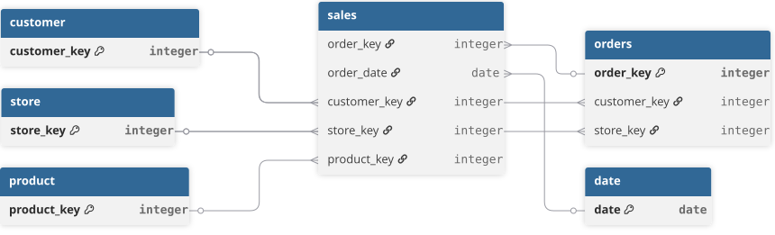

> This document outlines the technical implementation of the project, from raw data ingestion and quality assessment to analytical modeling and SQL optimization.

## Dataset Overview
A large-scale fictional company operating across multiple countries and regions. It provides comprehensive transactional data capturing end-to-end retail operations, including customer orders, product sales, store performance, and multi-currency transactions. The dataset comprises 8 relational tables covering the full order fulfilment lifecycle.    
Download Dataset [here](https://github.com/sql-bi/Contoso-Data-Generator-V2-data/releases/tag/ready-to-use-data) 

### Tech Stack & Data Architecture
**Tools:** PostgreSQL • DBeaver • Tableau    
**Architecture:** Raw → Clean → Gold → Analysis
```text
Raw Tables
   ↓
Clean Layer → Standardized views (validation, type casting)
   ↓
Gold Layer → Materialized view (customer_summary)
   ↓
Analysis Layer → Views (high_value_customers, at_risk_customers)
```
**Why this setup:** Separates raw data from business-ready model, improves performance, and ensures consistent metrics across analysis.

<br> 



<br>

### Data Load Issue
While loading `customer.csv`, the batch insert failed due to hidden null bytes (`\0`) present in 104,753 rows — invisible in editors like Excel but invalid in PostgreSQL UTF-8 encoding.

**Fix:** Null bytes were stripped using the `tr` command before reloading:

```bash
tr < customer.csv -d '\000' > customer_safe.csv
```
---
### Data Quality Assessment
After loading the data into the raw schema, quality checks were performed across all tables. The data was largely clean, with only minor issues found around null values, inconsistent casing, and decimal precision.

| Table        | Column     | Issue                               | Fix Applied                                |
|-------------------|------------------|-----------------------------------------------|-------------------------------------------|
| store             | close_date       | Empty strings                                 | NULLIF()                                  |
|                   | status           | Empty/null values                             | COALESCE(), NULLIF()                      |
| product           | color            | Inconsistent casing                           | INITCAP()                                 |
|                   | cost, price      | Inconsistent decimal precision                | ROUND()                                   |
| customer          | customer_name    | Inconsistent casing, leading/trailing spaces  | INITCAP(), TRIM()                         |
|                   | state            | Leading/trailing spaces                       | TRIM()                                    |
|                   | country          | Null values                                   | COALESCE()                                |
|                   | occupation       | Null values, inconsistent casing              | COALESCE(), INITCAP()                     |
| currency_exchange | exchange_rate    | Inconsistent decimal precision                | ROUND()                                   |
| sales             | unit_price, net_price, unit_cost, exchange_rate   | Inconsistent decimal precision      | ROUND()            |

## Analytical Methodology
**1. Customer Summary Table:** Built as materialized view to support analysis and improve query performance.   
**2. Customer Ranking:** `ROW_NUMBER()` used to identify top 10% and top 20% customers by revenue and profit.   
**3. Analytical Views:** `high_value_customers` (top 20% by revenue) and `at_risk_customers` (Declining customer segment) standardized downstream analysis.   
**4. Data-Driven Segmentation:** `PERCENTILE_CONT()` used to derive customer and store risk thresholds.   
**5. Recency Logic:** Recency measured against the latest available date in the dataset (Dec 31, 2024).   
**6. Query Design:** Used CTEs to simplify complex transformations and improve readability.     

---

**SQL Scripts:**  
DDL [here](sql/01_ddl)    
Database initialization [here](sql/db_init.sql)     
Data Quality Checks [here](sql/02_test)     
Analytics queries [here](sql/03_analytics)